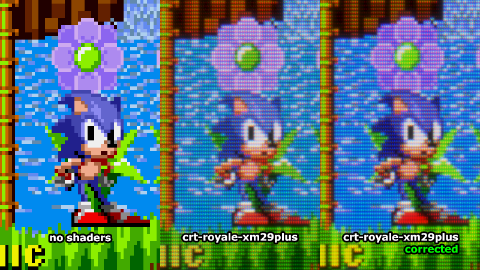

# crt-royale-xm29plus-corrected

Corrected colors for default RetroArch preset **crt-royale-xm29plus**

Make sure that you're using vulkan video driver

Copy `crt-royale-xm29plus-corrected.slangp` here: `shaders/shaders_slang/presets/`

Tested on RetroArch 1.12.0 with latest Slang Shaders
